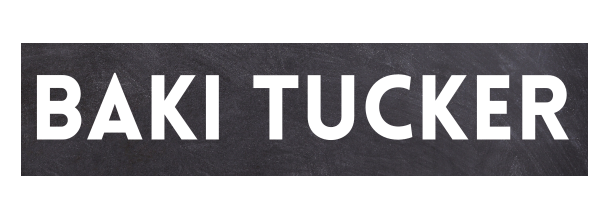

  
  
  
  
  

See [my website](https://bakitucker.netlify.app/) for more information!

<h1 align="center">Projects</h1>
<table bordercolor="#66b2b2">
  
  <tr>
    <td width="50%" valign="top">
      <h3 align="center">Nba Matching Card Game</h3>
         
        
         
        

          
    
  
      

        
<strong>Javascript, HTML, CSS</strong> - A Matching card game with your favorite NBA stars !!

    </td>
    <td width="50%" valign="top">
      <h3 align="center">Designer Slot Machine</h3>
         
      
         
        

          
  
  
      

        
<strong>Javascript, HTML, CSS</strong> - Slot Machine Game

    </td>
  </tr>
  
  <tr>
    <td width="50%" valign="top">
      <h3 align="center">My Porfolio</h3>
       
        
       
        

  
  
      

        
<strong>HTML5, CSS3, & Javascript</strong> - Portfolio Site including links to my projects and ways to get in contact with me.

    </td>
    <td width="50%" valign="top">
      <h3 align="center">Rock Paper Scissors Shoot Game</h3>
         
        
         
        

          
  
  
      

        
<strong>HTML5, CSS3, & Javascript</strong> - Simple Rock Paper Scissors shoot Game

    </td>
  </tr>
</table>

<h1 align="center">Technologies</h1>

    
    
    
    
    
    
    
    

---

<h1 align="center">Connect</h1>

  
  
  
  
  

